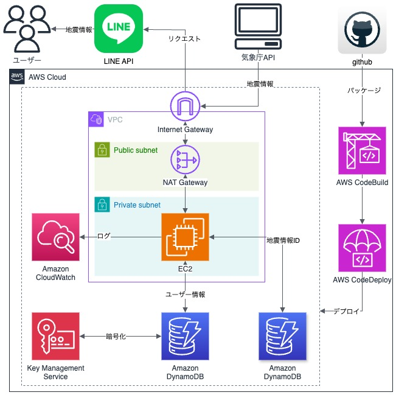

[日本語はこちら](README.md)

# Precautions

- This app uses information provided by the Japan Meteorological Agency based on its content usage terms. Source：Japan Meteorological Agency homepage（https://www.jma.go.jp/jma/kishou/info/coment.html）
- Information is edited and processed in accordance with the Japan Meteorological Agency's content usage terms. Source：Japan Meteorological Agency homepage（Same as above）
- This app uses information provided by P2P earthquake information. Source：P2P地震情報（https://www.p2pquake.net/develop/json_api_v2/#/）
- We are not responsible for any damage caused by the use of this app. We also do not guarantee the accuracy of the information provided.

---

# App Name: Quake Alert

## Site Overview

### Site Theme

"Quake Alert" is a real-time warning LINE official account designed to quickly notify users about earthquake information in Japan. When an earthquake occurs in a region registered by the user, they will receive timely information via LINE.

### Reason for choosing the theme

background of the matter: Japan is a country where earthquakes occur frequently, so receiving instant information is extremely important. Although there are existing disaster prevention systems, applications with notification and alert functions specific to individual users are still lacking.

**Strange things and challenges:**

- It is difficult to respond quickly after an earthquake occurs.
- There is a lack of personalized earthquake information distribution.
- I want to easily obtain earthquake information on my smartphone, but push notifications are complicated and difficult to manage.
- To solve the above issues, we developed a simple and customizable earthquake alert system using LINE.

## Target user

- People who want to obtain earthquake information in real time in Japan.
- People who live in a specific area and want to know earthquake information for that area as soon as possible.
- Persons in charge of disaster prevention at home or at work are required to respond quickly in emergencies.

## Main usage scenes

- Immediately after an earthquake occurs, users will receive an immediate notification through LINE, allowing them to respond quickly.
- Share the earthquake occurrence with your family and colleagues via LINE to prevent secondary disasters.
- Check information about the area where the earthquake occurred and use it for evacuation and response.

## Function list

- Real-time acquisition of earthquake information (using data provided by the Japan Meteorological Agency via P2P earthquake information).
- Distribute earthquake information in specific areas by linking with your LINE account.
- Set alerts for each region (prefecture) desired by the user.

## List of technologies used


## Infrastructure configuration



## Project setup

### Project clone to local

```bash
$ git clone https://github.com/24-105/line-quake-quick-alert.git
```

### Install Node.js

```bash
## using homebrew
$ brew install node@20

## using volta
$ volta install node@20
```

### Check version

```bash
$ node -v
$ npm -v
```

### Install the package

```bash
$ npm install
```

### Compile

```bash
$ npx tsc
```

## Docker setup

### Make directory

```bash
$ mkdir -p ./docker/dynamodb
```

### Creating and starting multiple containers

```bash
$ docker-compose up -d
```

### Check docker container

```bash
$ docker-compose ps
$ docker-compose logs dynamodb-local
$ docker-compose logs dynamodb-admin
```

### Create dynamodb table

```bash
$ NODE_ENV=local npx ts-node src/migration/dynamodb/channelAccessToken.ts
$ NODE_ENV=local npx ts-node src/migration/dynamodb/quakeHistory.ts
```

### Check if table was created

```bash
$ brew install awscli
$ aws dynamodb list-tables --endpoint-url http://localhost:8000
```

### Delete dynamodb table

```bash
$ aws dynamodb delete-table --table-name ChannelAccessToken --endpoint-url http://localhost:8000
$ aws dynamodb delete-table --table-name QuakeHistory --endpoint-url http://localhost:8000
```

### Stopping and removing containers

```bash
$ docker-compose down
```

## Compile and run the project

```bash
# local mode
$ npm run start:local

# development mode
$ npm run start:dev

# production mode
$ npm run start:prd

# watch mode
$ npm run start:debug
```

## Run tests

```bash
# unit tests
$ npm run test

# e2e tests
$ npm run test:e2e

# test coverage
$ npm run test:cov
```

## Recommended commit message

```bash
- build: Changes that affect the build system or external dependencies.
- ci: Changes to CI configuration files and scripts.
- docs: Document only changes.
- feat: New features.
- fix: Bug fixes.
- perf: Improved performance.
- refactor: refactoring.
- style: Changes that do not affect the meaning of the code.
- test: Add missing tests or modify existing tests
- chore: others
```

## Powered by NestJS

<p align="center">
  <a href="http://nestjs.com/" target="blank"></a>
</p>

[circleci-image]: https://img.shields.io/circleci/build/github/nestjs/nest/master?token=abc123def456
[circleci-url]: https://circleci.com/gh/nestjs/nest

  <p align="center">A progressive <a href="http://nodejs.org" target="_blank">Node.js</a> framework for building efficient and scalable server-side applications.</p>
    <p align="center">
<a href="https://www.npmjs.com/~nestjscore" target="_blank"></a>
<a href="https://www.npmjs.com/~nestjscore" target="_blank"></a>
<a href="https://www.npmjs.com/~nestjscore" target="_blank"></a>
<a href="https://circleci.com/gh/nestjs/nest" target="_blank"></a>
<a href="https://coveralls.io/github/nestjs/nest?branch=master" target="_blank"></a>
<a href="https://discord.gg/G7Qnnhy" target="_blank"></a>
<a href="https://opencollective.com/nest#backer" target="_blank"></a>
<a href="https://opencollective.com/nest#sponsor" target="_blank"></a>
  <a href="https://paypal.me/kamilmysliwiec" target="_blank"></a>
    <a href="https://opencollective.com/nest#sponsor"  target="_blank"></a>
  <a href="https://twitter.com/nestframework" target="_blank"></a>
</p>
  <!--[](https://opencollective.com/nest#backer)
  [](https://opencollective.com/nest#sponsor)-->

### Description

[Nest](https://github.com/nestjs/nest) framework TypeScript starter repository.

### Resources

Check out a few resources that may come in handy when working with NestJS:

- Visit the [NestJS Documentation](https://docs.nestjs.com) to learn more about the framework.
- For questions and support, please visit our [Discord channel](https://discord.gg/G7Qnnhy).
- To dive deeper and get more hands-on experience, check out our official video [courses](https://courses.nestjs.com/).
- Visualize your application graph and interact with the NestJS application in real-time using [NestJS Devtools](https://devtools.nestjs.com).
- Need help with your project (part-time to full-time)? Check out our official [enterprise support](https://enterprise.nestjs.com).
- To stay in the loop and get updates, follow us on [X](https://x.com/nestframework) and [LinkedIn](https://linkedin.com/company/nestjs).
- Looking for a job, or have a job to offer? Check out our official [Jobs board](https://jobs.nestjs.com).

### Support

Nest is an MIT-licensed open source project. It can grow thanks to the sponsors and support by the amazing backers. If you'd like to join them, please [read more here](https://docs.nestjs.com/support).

### Stay in touch

- Author - [Kamil Myśliwiec](https://twitter.com/kammysliwiec)
- Website - [https://nestjs.com](https://nestjs.com/)
- Twitter - [@nestframework](https://twitter.com/nestframework)

### License

Nest is [MIT licensed](https://github.com/nestjs/nest/blob/master/LICENSE).
